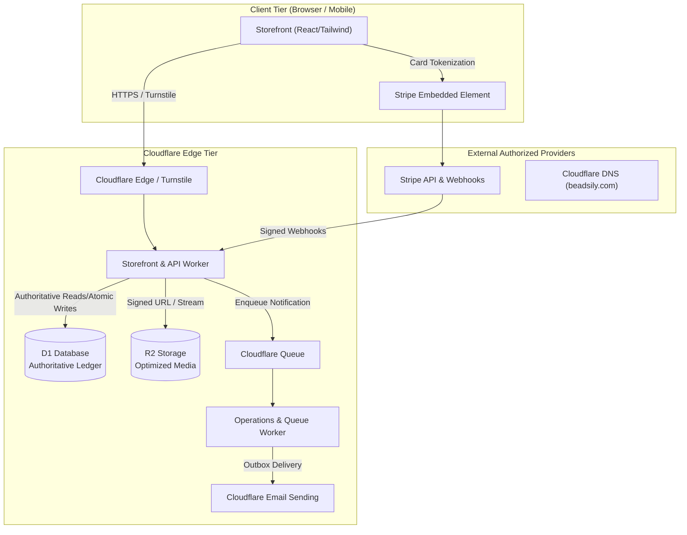

# ADR-001: BeadsILY Platform Topology & Cloudflare Edge Architecture

**Date:** October 6, 2026  
**Status:** PROPOSED (Architectural Decision Record)  
**Authors:** Michael (god), Jim (Cloudflare Solutions Architect)  
**Reviewers:** Dwight (Security), Toby (Independent QA)  
**Mission Reference:** [`MISSION-BEADSILY-COMMERCE.md`](file:///C:/repositories/beadsily-com-floor/missions/MISSION-BEADSILY-COMMERCE.md)

---

## 1. Context & Requirements

BeadsILY requires a dedicated, cost-effective direct-to-consumer commerce platform. Unlike marketplace/auction architectures observed in reference projects (ListMint, BidBolt), BeadsILY is a single-merchant brand with three distinct purchasing modes drawing from a shared component inventory:
1. **Nationwide 15+ Guest Party Kits:** Configurable packages requiring at least 15 guests (3 projects/guest = 45 finished items), with options for add-on guests, color palettes, and optional letter personalization.
2. **Curated Mystery Craft Boxes:** One-time purchase boxes with guaranteed project counts (e.g. Mystery Maker: 1 pen, 1 bracelet, 1 keychain = 3 projects; Bestie Duo: 6 projects; Mystery Party: 45 projects) and surprise colorways/styling.
3. **Physical Monthly Kit Subscriptions:** Themed physical craft boxes shipped on a recurring cycle with explicit cutoff, pause/skip, and capacity controls.
4. **School Booth Sales (October 23, 2026):** Local in-person festival sales drawing from the same stock, requiring offline-resilient reconciliation.

---

## 2. Decision Matrix

| Concern | Selected Architecture | Rejected Alternative | Rationale |
| :--- | :--- | :--- | :--- |
| **Storefront Runtime** | Next.js on Cloudflare Workers (evaluating `vinext` vs `OpenNext`) | Firebase App Hosting / Cloud Run | Unifies global edge delivery, zero cold starts, native Cloudflare bindings, and server-side rendering for SEO |
| **Database Authority** | Cloudflare D1 (SQLite) with relational schema & movement ledger | Cloudflare KV / Firestore | D1 provides relational integrity, foreign keys, and batch rollback; KV is strictly eventual consistency and cannot guarantee atomic inventory |
| **Media & Assets** | Cloudflare R2 Object Storage | Live Canva embeds / external CDN | R2 provides S3-compatible, zero-egress storage for owned, optimized WebP images, vector SVGs, and assembly PDFs |
| **Payments & Billing** | Stripe Embedded Payment Element & Billing Portal | Square (from MysteryBoxes) / Custom card forms | Stripe provides trusted PCI-compliant embedded checkout, native Apple Pay / Google Pay, and robust subscription lifecycle webhooks |
| **Inventory Coordination** | D1 atomic multi-component transactions with zero-row `UPDATE` checks | In-memory reservation / optimistic locking without checks | Guarantees all-or-nothing allocation across complex bills of materials (BOMs); prevents overselling under concurrency |
| **Background Tasks** | Cloudflare Queues + durable database outbox | Cloud Tasks / Node daemons | Integrated at-least-once queue pipeline with dead-letter queue (DLQ) support inside Cloudflare Workers |
| **Transactional Email** | Cloudflare Email Sending & Routing | SendGrid / Mailchimp (leaked/costly) | Native Workers Email Sending binding with DNS SPF/DKIM/DMARC alignment |
| **Edge Security** | Cloudflare Turnstile (server-validated) + HttpOnly sessions | Client-only CAPTCHA / Homegrown auth | Protects checkout and auth endpoints from bots with zero friction; server enforces signature checks |

---

## 3. Data Flow & Trust Boundaries

---

## 4. Invariants & Proof Requirements

1. **Atomic Multi-Component Reservation:** When a 15-guest kit is reserved, Oscar's D1 transaction must reserve all required beads, pens, clasps, and cord lengths simultaneously. If any single component lacks inventory, the conditional SQL `UPDATE ... WHERE available >= ?` will match 0 rows, triggering an explicit rollback of the entire batch.
2. **Prepacked Mystery Allocation:** Curated mystery boxes are tracked as sealed prepacked units. Stock decrement occurs at assembly time; purchase consumes the sealed box unit exactly once without rolling for components.
3. **Webhook Replay Idempotency:** Angela's webhook handler verifies the raw `stripe-signature` header, logs the event durably in D1 before processing, and rejects duplicate event IDs.
4. **Subscription Entitlement:** Subscriptions generate exactly one fulfillment entitlement per qualifying paid billing cycle invoice, verified against paid invoice lines.
