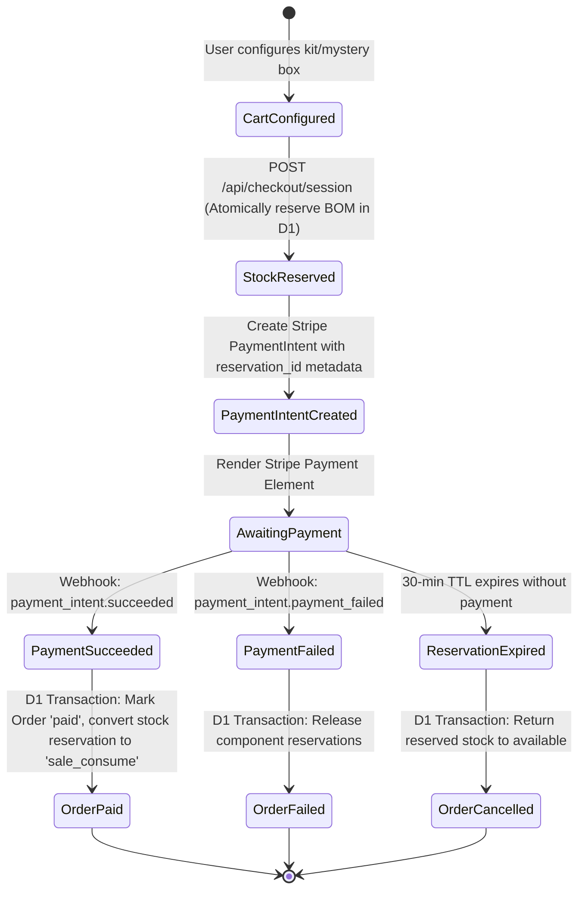
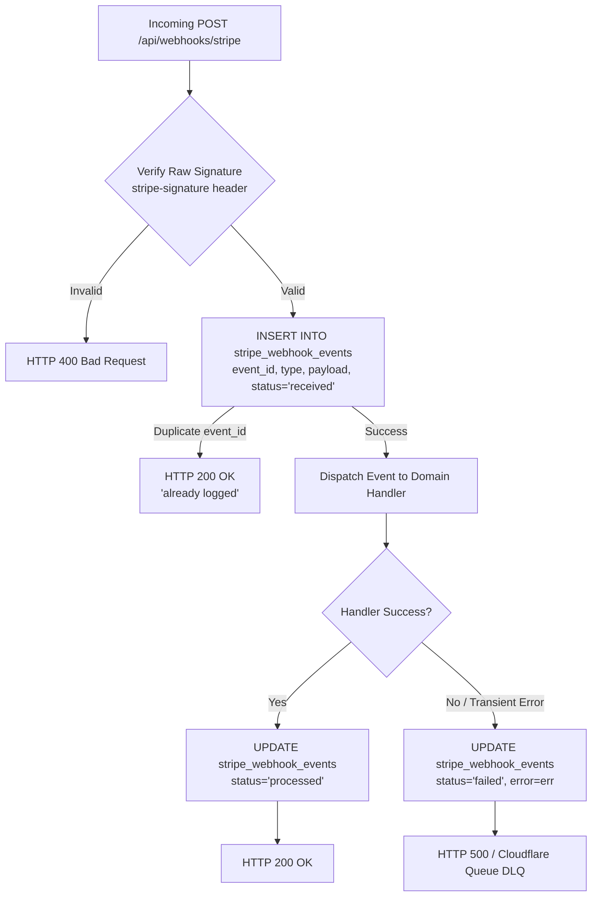
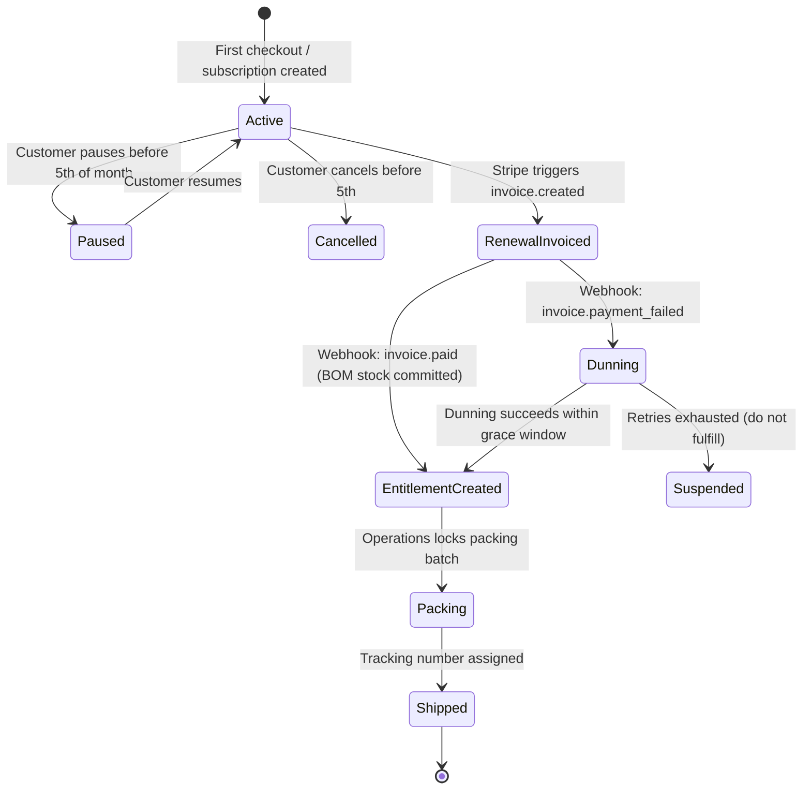

# ADR-002: BeadsILY Stripe Embedded Checkout, Webhook Reconciliation & Subscription Entitlements

**Date:** October 6, 2026  
**Status:** PROPOSED (Architectural Decision Record)  
**Author:** Angela (Commercial Payments & Subscriptions Lead, `angela-muwif3s4`)  
**Reviewers:** Dwight (Security & Privacy), Toby (Independent QA), Michael (god / Orchestrator)  
**Mission Reference:** [`MISSION-BEADSILY-COMMERCE.md`](file:///C:/repositories/beadsily-com-floor/missions/MISSION-BEADSILY-COMMERCE.md)  
**Acceptance Matrix:** `PAY-01` through `PAY-05`, `SUB-01` through `SUB-06`, `MYS-05`  
**D1 Schema Target:** Oscar (`BCF-7`)

---

## 1. Context & Business Invariants

BeadsILY operates a direct-to-consumer commerce model with three distinct financial transaction streams:
1. **Configured Party Kits (One-Time):** Base 15-guest kits (45 finished items) with incremental guest add-ons, colorway choices, and optional personalized letter bead allocations.
2. **Curated Mystery Craft Boxes (One-Time):** Guaranteed project counts (e.g. Mystery Maker: 3 projects; Bestie Duo: 6 projects) sold as prepacked sealed units. **Purchasing a one-time mystery box must never enroll a customer in recurring billing (`MYS-05`).**
3. **Physical Monthly Kit Subscriptions (Recurring):** Recurring physical craft kit delivery governed by America/Phoenix cutoff dates, with explicit pause/skip semantics and an entitlement model ensuring **exactly one physical box per paid monthly cycle**.

### Core Invariants
- **Server Authority (`PAY-01`):** Client requests send product IDs, configurations, and quantity; the server calculates prices, taxes, and shipping from authoritative D1 records. Amounts provided by clients are discarded.
- **Provider Evidence Drives Order State (`PAY-02`):** A client-side browser redirect or return URL is merely an indicator to poll or query server status; only verified Stripe webhook events or direct authenticated Stripe API retrieval can mark an order `paid`.
- **Durable Webhook Idempotency (`PAY-03`, `PAY-04`):** Every webhook is cryptographically validated using `stripe-signature` against the raw request body, written to an append-only `stripe_webhook_events` D1 table prior to processing, and processed with database-level idempotency to prevent duplicate charges or fulfillment.
- **Strict Customer Isolation (`PAY-05`):** Customers can access only their own orders and Billing Portal sessions. Billing portal URLs are short-lived, generated server-side for authenticated users, and enforce a trusted return URL allowlist.
- **Subscription Entitlement Uniqueness (`SUB-01`..`SUB-06`):** Subscriptions are financial relationships; fulfillment is an operational entitlement. An entitlement is created **if and only if** a qualifying renewal invoice is paid. Proration invoices, retried payment events, or plan adjustments must never generate extra physical boxes.

---

## 2. Platform Architecture & Edge Runtime

### 2.1 Stripe SDK on Cloudflare Workers
Cloudflare Workers does not support legacy Node HTTP modules. The modern Stripe Node SDK (`stripe@^17.x`) is utilized with the native fetch HTTP client:

```typescript
import Stripe from 'stripe';

export function createStripeClient(apiKey: string): Stripe {
  return new Stripe(apiKey, {
    apiVersion: '2024-09-30.acacia',
    httpClient: Stripe.createFetchHttpClient(),
    appInfo: {
      name: 'BeadsILY Commerce',
      version: '1.0.0',
      url: 'https://beadsily.com'
    }
  });
}
```

### 2.2 Embedded Payment Element vs Hosted Checkout
- **Selected:** Stripe **Embedded Payment Element** hosted within BeadsILY's checkout page (`apps/storefront/src/app/checkout`).
- **Rationale:** Keeps customers in the branded BeadsILY experience across mobile devices, supports Apple Pay, Google Pay, and Link seamlessly, while isolating PCI compliance within Stripe's iframe container.
- **Separate Flows:** One-time checkout and recurring subscription checkout utilize separate initialization endpoints to guarantee clean separation between one-time `PaymentIntent` and recurring `Subscription` setups.

---

## 3. Checkout & Payment State Machine



### 3.1 Reservation & Payment TTL Alignment (`INV-06`, `INV-07`)
1. When the client initiates checkout, Oscar's D1 procedure reserves all BOM components with a 30-minute hold (`reservation_expires_at = now + 1800`).
2. The Stripe `PaymentIntent` is created with metadata: `{ order_id, reservation_id, customer_id }`.
3. If payment succeeds after the reservation expires (e.g. delayed asynchronous payment method), the webhook handler detects the expired reservation. Instead of silently overselling, it places the order in `payment_hold_manual_review` and creates an operational audit record for host resolution or immediate refund (`INV-07`).

---

## 4. Webhook Processing & Reconciliation Pipeline (`PAY-03`, `PAY-04`)



### 4.1 Webhook Verification Implementation
```typescript
export async function handleStripeWebhook(request: Request, env: Env): Promise<Response> {
  const signature = request.headers.get('stripe-signature');
  if (!signature) {
    return new Response('Missing signature header', { status: 400 });
  }

  const rawBody = await request.text();
  const stripe = createStripeClient(env.STRIPE_SECRET_KEY);

  let event: Stripe.Event;
  try {
    event = await stripe.webhooks.constructEventAsync(
      rawBody,
      signature,
      env.STRIPE_WEBHOOK_SECRET
    );
  } catch (err: any) {
    return new Response(`Signature verification failed: ${err.message}`, { status: 400 });
  }

  // Idempotent insertion into D1
  const existing = await env.DB.prepare(
    'SELECT status FROM stripe_webhook_events WHERE event_id = ?'
  ).bind(event.id).first();

  if (existing) {
    return new Response(JSON.stringify({ received: true, deduplicated: true }), {
      headers: { 'Content-Type': 'application/json' },
      status: 200
    });
  }

  await env.DB.prepare(
    `INSERT INTO stripe_webhook_events (event_id, event_type, payload, status, created_at)
     VALUES (?, ?, ?, 'received', unixepoch())`
  ).bind(event.id, event.type, JSON.stringify(event)).run();

  // Execute domain transition...
  return new Response(JSON.stringify({ received: true }), {
    headers: { 'Content-Type': 'application/json' },
    status: 200
  });
}
```

---

## 5. Monthly Subscription Lifecycle & Fulfillment Entitlements (`SUB-01`..`SUB-06`)

### 5.1 Business Rules & Cadence
- **Timezone Authority:** `America/Phoenix` (Mountain Standard Time, no Daylight Saving Time).
- **Monthly Drop Cadence:** Drops are versioned (e.g. `DROP-2026-11` Desert Sunset, `DROP-2026-12` Holiday Sparkle).
- **Cutoff Rule (`SUB-04`):** The 5th day of the month at 23:59:59 America/Phoenix.
  - A pause, skip, or cancellation initiated **before or at** 23:59:59 on the 5th affects the upcoming drop.
  - A pause, skip, or cancellation initiated **after** 23:59:59 takes effect for the subsequent cycle; the already-billed drop proceeds to packing.
- **Fulfillment Entitlement Invariant (`SUB-01`, `SUB-02`):**
  - Exactly **one** `subscription_entitlements` record per customer per monthly drop cycle.
  - Keyed by unique constraint: `UNIQUE(subscription_id, cycle_drop_id)`.
  - Triggered exclusively by `invoice.paid` where `billing_reason` IN (`'subscription_create'`, `'subscription_cycle'`).
  - Proration invoices (`subscription_update`), one-off test invoices, or payment retries are rejected by the entitlement processor.



### 5.2 Address Change Protection (`SUB-05`)
- When a customer updates their address via the BeadsILY customer portal:
  - If a pending entitlement for the current drop is in status `'pending'` or `'allocated'`, update the entitlement shipping address snapshot.
  - If the entitlement is already `'in_packing'` or `'shipped'`, lock the address and instruct the customer to contact support.
  - Billing address modifications in Stripe never alter the physical shipping address of existing entitlements without explicit customer confirmation.

---

## 6. D1 Relational Schema Specification (for Oscar / `BCF-7`)

```sql
-- Orders Table
CREATE TABLE orders (
  id TEXT PRIMARY KEY,
  order_number TEXT UNIQUE NOT NULL, -- Human readable e.g. BLY-2026-0001
  customer_id TEXT NOT NULL REFERENCES customers(id),
  order_type TEXT NOT NULL CHECK (order_type IN ('party_kit', 'mystery_box', 'subscription_drop', 'finished_good')),
  status TEXT NOT NULL CHECK (status IN (
    'pending_payment', 'paid', 'payment_failed', 'cancelled', 
    'processing', 'partially_fulfilled', 'fulfilled', 'refunded'
  )),
  currency TEXT NOT NULL DEFAULT 'usd',
  subtotal_cents INTEGER NOT NULL,
  discount_cents INTEGER NOT NULL DEFAULT 0,
  tax_cents INTEGER NOT NULL DEFAULT 0,
  shipping_cents INTEGER NOT NULL DEFAULT 0,
  total_cents INTEGER NOT NULL,
  stripe_payment_intent_id TEXT UNIQUE,
  stripe_checkout_session_id TEXT UNIQUE,
  reservation_id TEXT UNIQUE,
  shipping_address_json TEXT NOT NULL,
  created_at INTEGER NOT NULL,
  updated_at INTEGER NOT NULL
);

-- Order Items with Configuration Snapshot
CREATE TABLE order_items (
  id TEXT PRIMARY KEY,
  order_id TEXT NOT NULL REFERENCES orders(id),
  product_id TEXT NOT NULL REFERENCES products(id),
  product_title TEXT NOT NULL,
  variant_sku TEXT NOT NULL,
  quantity INTEGER NOT NULL DEFAULT 1,
  unit_price_cents INTEGER NOT NULL,
  total_price_cents INTEGER NOT NULL,
  configuration_json TEXT, -- Snapshots guest count, colors, personalization letters
  sealed_box_unit_id TEXT, -- For mystery boxes (MYS-03)
  created_at INTEGER NOT NULL
);

-- Webhook Deduplication & Audit Ledger (PAY-03, PAY-04)
CREATE TABLE stripe_webhook_events (
  event_id TEXT PRIMARY KEY,
  event_type TEXT NOT NULL,
  status TEXT NOT NULL CHECK (status IN ('received', 'processed', 'failed')),
  payload TEXT NOT NULL,
  error_message TEXT,
  received_at INTEGER NOT NULL DEFAULT (unixepoch()),
  processed_at INTEGER
);

-- Subscriptions Table
CREATE TABLE subscriptions (
  id TEXT PRIMARY KEY,
  customer_id TEXT NOT NULL REFERENCES customers(id),
  stripe_subscription_id TEXT UNIQUE NOT NULL,
  stripe_customer_id TEXT NOT NULL,
  status TEXT NOT NULL CHECK (status IN (
    'active', 'past_due', 'unpaid', 'canceled', 'incomplete', 'paused'
  )),
  plan_sku TEXT NOT NULL,
  current_period_start INTEGER NOT NULL,
  current_period_end INTEGER NOT NULL,
  cancel_at_period_end INTEGER NOT NULL DEFAULT 0,
  default_shipping_address_json TEXT NOT NULL,
  created_at INTEGER NOT NULL,
  updated_at INTEGER NOT NULL
);

-- Subscription Monthly Drop Definitions
CREATE TABLE subscription_drops (
  id TEXT PRIMARY KEY, -- e.g. DROP-2026-11
  title TEXT NOT NULL,
  theme_name TEXT NOT NULL,
  bom_id TEXT NOT NULL REFERENCES bill_of_materials(id),
  cutoff_at INTEGER NOT NULL, -- Unix timestamp in America/Phoenix
  ship_window_start INTEGER NOT NULL,
  ship_window_end INTEGER NOT NULL,
  capacity_limit INTEGER NOT NULL,
  units_allocated INTEGER NOT NULL DEFAULT 0,
  is_active INTEGER NOT NULL DEFAULT 1
);

-- Monthly Box Fulfillment Entitlements (SUB-01, SUB-02)
CREATE TABLE subscription_entitlements (
  id TEXT PRIMARY KEY,
  subscription_id TEXT NOT NULL REFERENCES subscriptions(id),
  drop_id TEXT NOT NULL REFERENCES subscription_drops(id),
  stripe_invoice_id TEXT UNIQUE NOT NULL,
  status TEXT NOT NULL CHECK (status IN (
    'entitled', 'allocated', 'in_packing', 'shipped', 'skipped', 'refunded'
  )),
  shipping_address_snapshot TEXT NOT NULL,
  tracking_number TEXT,
  carrier TEXT,
  shipped_at INTEGER,
  created_at INTEGER NOT NULL,
  updated_at INTEGER NOT NULL,
  UNIQUE (subscription_id, drop_id) -- Invariant: exactly 1 box per cycle
);
```

---

## 7. Acceptance Criteria & Test Verification Plan

| Case ID | Verification Method | Expected Outcome |
| :--- | :--- | :--- |
| **PAY-01** | Attempt checkout with payload altering `$99.00` price to `$10.00`. | Request rejected or recalculated to canonical server price. Client total ignored. |
| **PAY-02** | Directly call redirect success URL without triggering Stripe payment. | Order remains in `pending_payment`; fulfillment blocked. |
| **PAY-03** | Send webhook with manipulated HMAC signature; replay identical webhook twice. | Invalid signature yields HTTP 400. Replay yields HTTP 200 with no duplicate D1 state change. |
| **PAY-04** | Simulate database failure during webhook handling. | Error returned to Stripe to prompt retry; webhook reconciliation recovers order cleanly on next attempt. |
| **PAY-05** | Guest user submits another customer's ID to request Billing Portal session. | Session rejected with HTTP 403 / 401; identity validated against authenticated JWT/session. |
| **SUB-01** | Execute test harness simulating initial signup + 2 renewal cycles. | Exactly 3 entitlements generated with distinct drop IDs and verified paid invoice references. |
| **SUB-02** | Inject duplicate `invoice.paid` and proration `invoice.paid` events. | Unique constraint catches duplicate; proration ignored; zero additional entitlements created. |
| **SUB-03** | Inject `invoice.payment_failed` followed by customer payment recovery. | No entitlement created while failed; entitlement created immediately upon recovery payment. |
| **SUB-04** | Trigger pause at 23:58 America/Phoenix vs 00:02 next day. | Pre-cutoff pause skips upcoming drop; post-cutoff pause takes effect for following cycle. |
| **SUB-05** | Update customer shipping address while entitlement is `in_packing`. | Entitlement shipping address remains locked; system warns customer that packing has commenced. |
| **SUB-06** | Subscription renewal triggers when `units_allocated >= capacity_limit`. | Entitlement placed on operational hold; customer notified; zero overselling of physical components. |
| **MYS-05** | Purchase Mystery Maker box. | Checkout completes under one-time PaymentIntent mode; customer has zero Stripe subscriptions. |

---

## 8. Rollback & Disaster Recovery
- **Code Rollback:** Reverting Worker deployment reverts API endpoints but preserves existing D1 ledger records.
- **Financial Reconciliation:** If a webhook fails or is delayed, an hourly reconciliation job compares Stripe's `events` list against `stripe_webhook_events` to backfill missing entries.
- **Live Charge Guard:** No live credentials are configured until Korry Nelson explicitly authorizes live cutover.
