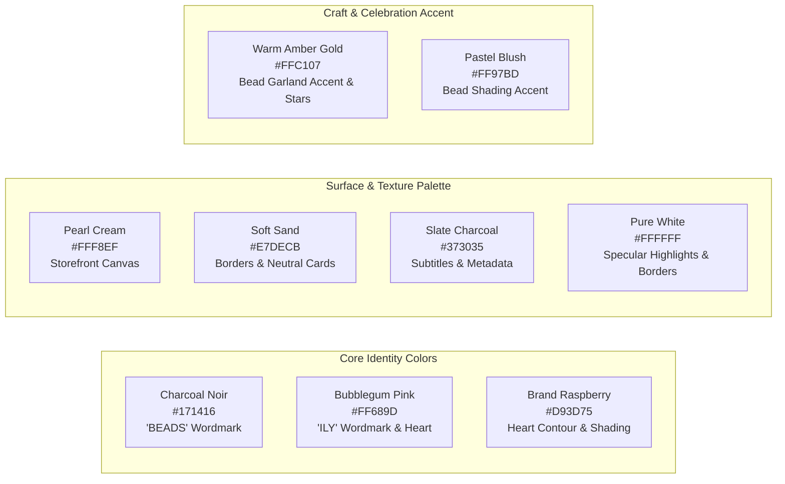

# BeadsILY Brand Asset Inventory & Provenance Manifest

**Author:** Karen (`karen-muwifd9v`), Brand & Creative Direction Lead  
**Accountable Manager:** Michael (`god`, Floor Scribe)  
**Owner:** Korry Nelson  
**Date:** October 6, 2026  
**Version:** 1.0.0 (Foundation Milestone)  
**Repository Location:** `beadsily-com`

---

## 1. Physical & Digital Source Asset Inventory

| Asset Name | Source Path | Format & Dimensions | Origin & Provenance | Status in BeadsILY |
| :--- | :--- | :--- | :--- | :--- |
| **Canopy Banner 8x2ft Master** | `C:\Users\Korry\Downloads\Telegram Desktop\beadsily-canopy-banner-8x2ft.pdf` | Vector PDF, MediaBox `0 0 6912 1728` pt ($8\text{ ft} \times 2\text{ ft}$) | Created Sept 28, 2026 via Inkscape 1.2.2 / Cairo 1.18.0; verified C2PA Content Credentials manifest embedded. | **ACTIVE OFFICIAL BRAND MASTER.** Primary source of truth for wordmark, heart mark, colors, and tagline. |
| **Beadifully Yours Legacy AI** | `C:\Users\Korry\Documents\!Clients\beadifullyyours.com\logo-1.ai` | Adobe Illustrator 28.6 (PDF-1.6 vector) | Created Aug 2, 2024; legacy iteration for former name "Beadifully Yours". | **HISTORICAL ARCHIVE.** Superseded by BeadsILY identity; preserved for design provenance only. |
| **Beadifully Yours Legacy SVG** | `C:\Users\Korry\Documents\!Clients\beadifullyyours.com\logo-1.svg` | SVG 1.1 with Paper.js data, $350 \times 240\text{ pt}$ | Exported Aug 1, 2024; linear gradient `#7B4397` to `#DC2430`. | **HISTORICAL ARCHIVE.** Superseded by BeadsILY identity. |
| **Beadifully Yours Legacy PNG** | `C:\Users\Korry\Documents\!Clients\beadifullyyours.com\logo1@4x.png` | PNG, $1400 \times 960\text{ px}$, 80.8 KB | Exported Aug 2, 2024. | **HISTORICAL ARCHIVE.** |

---

## 2. Reverse-Engineered Master Color Palette

Extracted directly from the uncompressed vector stream of `beadsily-canopy-banner-8x2ft.pdf`:

### Color Token Registry

| Token Key | Hex Value | RGB Components | HSL Equivalent | Primary Usage in BeadsILY |
| :--- | :---: | :---: | :---: | :--- |
| `colors.charcoal[950]` | `#171416` | `(23, 20, 22)` | `320°, 7%, 8%` | Primary wordmark "BEADS", primary body copy, dark surface canvas |
| `colors.charcoal[700]` | `#373035` | `(55, 48, 53)` | `317°, 7%, 20%` | Secondary descriptions, captions, input hover borders |
| `colors.pink[500]` | `#FF689D` | `(255, 104, 157)` | `339°, 100%, 70%` | Wordmark "ILY", primary CTA button fill, hero pill badges |
| `colors.pink[300]` | `#FF97BD` | `(255, 151, 189)` | `338°, 100%, 80%` | Soft blush bead fills, highlight overlays, soft card backgrounds |
| `colors.raspberry[500]` | `#D93D75` | `(217, 61, 117)` | `338°, 67%, 55%` | Master vector stroke, heart contour arc, headings $\ge 24\text{px}$ |
| `colors.raspberry.text` | `#C72B63` | `(199, 43, 99)` | `338°, 64%, 47%` | **Accessible text links and interactive body labels** (5.04:1 WCAG AA) |
| `colors.amber[500]` | `#FFC107` | `(255, 193, 7)` | `45°, 100%, 51%` | Sunburst bead accent, customer star ratings, celebratory tags |
| `colors.cream[100]` | `#FFF8EF` | `(255, 248, 239)` | `34°, 100%, 97%` | Warm Pearl Cream background (all storefront pages and boxes) |
| `colors.cream[300]` | `#E7DECB` | `(231, 222, 203)` | `41°, 37%, 85%` | Dividing rules, subtle card outlines, disabled border states |
| `colors.cream[50]` | `#FFFFFF` | `(255, 255, 255)` | `0°, 0%, 100%` | Pure crisp white (product card fill, modal surfaces, highlights) |

---

## 3. Production Deliverables Generated in Repository

The following production-ready assets have been compiled and placed into the repository:

### 3.1. Vector Brand Assets (`public/brand/` & `packages/ui/src/brand/`)

1. **`beadsily-logo.svg`:**
   - Elements: Wordmark "BEADS" (`#171416`) + "ILY" (`#FF689D`) with the layered heart tittle on the "I".
   - ViewBox: `1640 80 3830 867` (scalable, lossless vector).
   - Accessibility: Includes `<title>` and `<desc>` tags for screen readers.
2. **`beadsily-logo-tagline.svg`:**
   - Elements: Full logo lockup + official tagline: `BRACELETS • KEYCHAINS • BEADABLES` in Deep Charcoal small caps.
   - ViewBox: `1640 80 3830 1560`.
3. **`beadsily-heart-icon.svg`:**
   - Elements: Standalone heart tittle with specular white highlight arc and raspberry inner shadow.
   - ViewBox: `4210 115 200 200` (perfect 1:1 square for favicon, app icon, social media avatars).
4. **`beadsily-logo-white.svg`:**
   - Elements: Pure white monochrome wordmark with inverted highlight stroke for dark hero sections.

### 3.2. Code & Design Tokens (`packages/ui/src/`)

1. **`tokens/colors.ts`:** Complete typed color palette with semantic roles and WCAG annotations.
2. **`tokens/typography.ts`:** Display serif, accent sans, body sans, and fluid font scales.
3. **`tokens/spacing.ts`:** Radii, elevation shadows, and physical packaging dimensions for 15-guest kits and mystery boxes.
4. **`tokens/index.ts`:** Barrel export.
5. **`tailwind.preset.ts`:** Zero-config Tailwind CSS preset ready for Next.js storefront consumption.
6. **`index.ts`:** Public package entry point.

### 3.3. Technical Documentation (`docs/brand/`)

1. **`CONTRAST-VERIFICATION.md`:** Comprehensive WCAG 2.2 AA contrast matrix with mathematical luminance formulas and UI pairing rules.
2. **`PACKAGING-AND-ASSET-GUIDELINES.md`:** Detailed physical packout specifications for Pam & Operations, box engineering, host instruction cards, and school booth setup.
3. **`BRAND-ASSET-MANIFEST.md`:** This document.

---

## 4. Pending Owner Resolution for Korry Nelson

Under `board.md` Section 5 (*Owner Decisions & Escalations*):
- **Item:** BeadsILY Brand Source Assets.
- **Status:** Vector package and canopy banner successfully extracted, verified, and converted to production SVGs and Tailwind tokens.
- **Pending Decision for Korry:** Confirm whether a dedicated Canva Brand Kit ID exists under Lua's or Korry's Canva account. If yes, provide the ID for authoring parity; if no, this repository's `packages/ui/src/tokens` is now the authoritative single source of truth for the entire engineering office.
