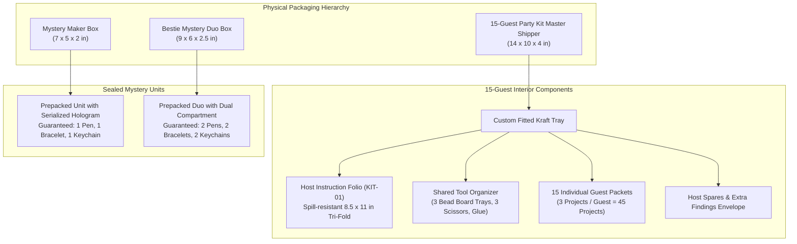

# BeadsILY Asset Production & Physical Packaging Guidelines

**Author:** Karen (`karen-muwifd9v`), Brand & Creative Direction Lead  
**Operations Partner:** Pam (`pam-muwic8fg`, Product & Operations Lead)  
**Storefront Partner:** Erin (`erin-muwidjtc`, Storefront UX Engineer)  
**Independent Reviewer:** Toby (`toby-muwie8nd`, Independent QA Certifier)  
**Approved by:** Korry Nelson (Owner), Michael (`god`, Floor Manager)  
**Date:** October 6, 2026  
**Version:** 1.0.0 (Launch Foundation)

---

## 1. Physical Packaging Specifications

BeadsILY delivers high-touch, premium physical craft experiences. Packaging must protect delicate components, prevent bead spillage during unboxing, clearly separate shared tools from individual guest supplies, and convey luxury warmth rather than industrial bulk.



---

### 1.1. 15-Guest Party Kit Master Shipper (KIT-MASTER-15)

The flagship product is a complete party experience for a minimum of 15 guests, producing **45 finished projects** (3 projects per guest: 1 pen, 1 bracelet, 1 keychain or configured combination).

| Dimension / Spec | Specification | Operational Justification |
| :--- | :--- | :--- |
| **Exterior Dimensions** | 14 in (L) $\times$ 10 in (W) $\times$ 4 in (H) | Accommodates 15 individual guest packets, 3 shared bead sorting boards, host tools, and folio without crushing. |
| **Box Construction** | Roll-End Tuck Front (RETF) with dust flaps | Sturdy re-closable box; lid stays open at $90^\circ$ for tabletop party serving. |
| **Material & Flute** | 32 ECT E-flute / B-flute White Corrugated | Rigid impact resistance; lightweight shipping profile ($< 4.5\text{ lbs}$ total kit weight). |
| **Exterior Print** | Full exterior Pearl Cream (`#FFF8EF`) flood coat with 2-color spot printing: Charcoal Noir (`#171416`) logo on top lid, Bubblegum Pink (`#FF689D`) heart accent on front latch. | High-end boutique presentation; recognizable unboxing moment. |
| **Interior Print** | Inside lid printed in Raspberry (`#D93D75`) with welcome message: *"Welcome to your BeadsILY party! Open the Host Folio first."* | Immediate orientation for the novice party host; prevents chaotic unboxing. |
| **Tamper Seal** | 2.5 in round holographic label over front tuck tab featuring the BeadsILY Heart Icon and batch lot code. | Guarantees sealed integrity during transit. |

#### Master Kit Internal Tray Partitioning:
1. **Top Tier:** Host Instruction Folio (KIT-01) resting in recessed lid pocket.
2. **Left Compartment (6.5 x 9 in):** 15 individually sealed guest pouches, grouped by colorway/theme.
3. **Right Compartment (6.5 x 9 in):** Shared tool caddy containing 3 plastic bead sorting trays, 3 kid-safe safety snippers, 2 tubes hypo-cement jewelry glue, 15 pre-measured elastic cords, and 15 pen hardware rods.
4. **Bottom Center:** "Host Rescue Envelope" with spare clasps, assorted accent beads, and extra cord lengths.

---

### 1.2. Curated Mystery Box Packaging

Per **Revision 1.1.0 invariants**, mystery boxes are treated as **prepacked physical sealed units**, not lotteries or gambling games. Project counts and supplies are 100% guaranteed.

#### Product A: Mystery Maker Single Box (MYS-SINGLE-01)
- **Projects Guaranteed:** Exactly 3 finished projects (1 beadable pen, 1 stretch bracelet, 1 clip-on keychain).
- **Surprise Elements:** Coordinated color palette, focal charms, accent bead finishes.
- **Dimensions:** 7 in (L) $\times$ 5 in (W) $\times$ 2 in (H).
- **Style:** Two-piece rigid kraft carton with Pearl Cream slipcover.
- **Sealing Invariant:** Prepacked in warehouse inventory, sealed with a numbered tamper sticker (`MYS-UNIT-[LOT]-[SEQ]`). The assigned sealed unit is permanently associated with the customer's Stripe checkout session and never swapped on webhook retry.

#### Product B: Bestie Mystery Duo Box (MYS-DUO-01)
- **Projects Guaranteed:** Exactly 6 finished projects (2 pens, 2 bracelets, 2 keychains) designed as complementary matching sets for two crafters.
- **Dimensions:** 9 in (L) $\times$ 6 in (W) $\times$ 2.5 in (H).
- **Style:** Rigid clamshell box with dual interior compartments labeled *"Yours"* and *"Bestie's"*.

---

### 1.3. Host Instruction & Recipe Folio (KIT-01)

The host instruction guide is the critical link between unboxing and party success. It must be effortlessly usable by a novice adult host managing 15 energetic guests.

1. **Physical Format:** 8.5 $\times$ 11 in flat, folded as a 3-panel roll-fold ($3.66 \times 8.5\text{ in}$ folded footprint).
2. **Paper Stock:** 100 lb Silk Cover with soft-touch matte aqueous coating (water/spill-resistant against spilled drinks and glue drops).
3. **Typography Hierarchy:**
   - Panel 1 (Cover): Clean serif title *"Host Party Blueprint"* + BeadsILY Wordmark + estimated party timeline (e.g. *"90 Minutes of Crafting Joy"*).
   - Panel 2 (Setup): Step-by-step table setup guide (arranging trays, distributing supplies).
   - Panels 3–4 (Technique): Clear macro-photography diagrams illustrating the 3 core projects:
     1. How to assemble and lock beadable pens (thread sequence, tensioning, securing tip).
     2. How to string and knot stretch bracelets (the surgeon's knot + glue drop technique).
     3. How to attach keychain clasp rings and focal charms.
   - Panel 5 (Troubleshooting): Knot slippage solutions, re-stringing, focal placement advice.
   - Panel 6 (Back Cover): Large $1.5 \times 1.5\text{ in}$ high-contrast QR code pointing to `beadsily.com/guides/party-host` for interactive video walkthroughs.

---

### 1.4. School Booth Collateral (Santa Fe Elementary, Oct 23)

To present a professional, cohesive retail presence at the Fall Festival school booth:

1. **Canopy Banner:**
   - Source: `beadsily-canopy-banner-8x2ft.pdf` (vector master).
   - Dimensions: 8 ft wide $\times$ 2 ft high.
   - Finishing: 13 oz outdoor matte vinyl, hemmed edges, silver grommets placed every 24 inches along top and bottom edges, reinforced welded corners for outdoor canopy fastening.
2. **Tabletop Acrylic Display Stands (2 Units):**
   - Size: 5 $\times$ 7 in vertical acrylic sign holders.
   - Card 1: *"Design Your Own Craft Experience — 15+ Guest Party Kits"* with prominent QR code.
   - Card 2: *"Monthly Craft Mystery Boxes"* with QR code leading to the waitlist signup.
3. **Host Invitation Take-Home Cards (500 Units):**
   - Size: $4 \times 6\text{ in}$ postcard on 16pt velvet touch cardstock with soft-touch coating.
   - Headline: *"Host the Ultimate Bead Party at Home."*
   - Includes QR code linked with UTM campaign tracking: `https://beadsily.com/?utm_source=school_booth&utm_medium=qr&utm_campaign=fall_festival_2026`.

---

## 2. Digital Asset Production & Storage Rules

Per standing mandate in `MISSION-BEADSILY-COMMERCE.md` and Karen's goal:

1. **Owned Platform Storage:** All visual assets must live within the repository under `public/brand/` and `packages/ui/src/brand/`.
2. **No Expiring Live Canva Embeds:** Canva is authorized strictly for creative composition and authoring. Every design must be exported into static, version-controlled SVG or WebP files before production commit. Never embed iframe widgets or unauthenticated Canva CDN URLs in storefront code.
3. **Optimized Asset Pipeline:**
   - **Vector Logos:** Clean SVG with normalized `viewBox`, self-contained path definitions, no external CSS dependencies, and semantic `<title>` / `<desc>` elements for accessibility.
   - **Photographic Media:** Handled through R2 storage with WebP and AVIF conversions. Maximum hero image weight: $\le 150\text{ KB}$; product thumbnail weight: $\le 45\text{ KB}$.
   - **No Unapproved Trademarks:** Only owner-approved brand marks ("BeadsILY", heart logo mark, Lua founder illustrations) are committed. Reference repository assets from ListMint or BidBolt must never be committed.

---

## 3. Brand Asset Directory Map

```text
beadsily-com/
├── public/
│   └── brand/
│       ├── beadsily-logo.svg           # Primary wordmark (Charcoal + Pink + Heart)
│       ├── beadsily-logo-tagline.svg   # Primary lockup with tagline
│       ├── beadsily-logo-white.svg     # Monochrome white for dark hero banners
│       └── beadsily-heart-icon.svg     # Standalone heart icon (favicon / avatar)
├── packages/
│   └── ui/
│       └── src/
│           ├── brand/
│           │   ├── beadsily-logo.svg
│           │   ├── beadsily-logo-tagline.svg
│           │   ├── beadsily-logo-white.svg
│           │   └── beadsily-heart-icon.svg
│           └── tokens/
│               ├── colors.ts           # Authoritative hex ramp & accessible tokens
│               ├── typography.ts       # Font families, sizes, and tracking
│               ├── spacing.ts          # Radii, elevation, and packaging specs
│               └── index.ts            # Token barrel export
└── docs/
    └── brand/
        ├── CONTRAST-VERIFICATION.md    # WCAG 2.2 mathematical contrast matrix
        ├── PACKAGING-AND-ASSET-GUIDELINES.md # This document
        └── BRAND-ASSET-MANIFEST.md     # Inventory & source provenance
```
