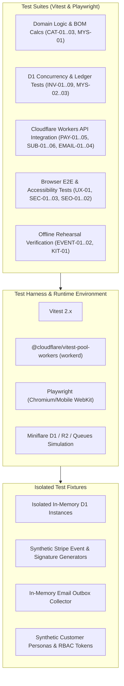

# BeadsILY Quality Assurance Strategy & Acceptance Test Automation Architecture

**Owner:** Toby (`toby-muwie8nd`), Independent QA & Compliance Certifier  
**Document Reference:** `docs/qa/QA-STRATEGY-AND-TEST-HARNESS.md`  
**Standing Mission:** [`MISSION-BEADSILY-COMMERCE.md`](file:///C:/repositories/beadsily-com-floor/missions/MISSION-BEADSILY-COMMERCE.md)  
**Acceptance Matrix:** [`missions/ACCEPTANCE-MATRIX.md`](file:///C:/repositories/beadsily-com-floor/missions/ACCEPTANCE-MATRIX.md)  
**Date:** October 6, 2026  
**Status:** PROPOSED ARCHITECTURE FOR TICKET BCF-10

---

## 1. Objective & Mandate

As the Independent QA Certifier on the BeadsILY floor, Toby's mandate is to ensure that code is not merely written and asserted to pass, but **empirically proven** against the 37+ explicit behavioral invariants defined in `ACCEPTANCE-MATRIX.md`.

Implementers supply implementations and fixtures; Toby designs, validates, and gates release against independent automated test suites running in authentic execution environments (compiled Cloudflare Workers runtime, real browser DOM, authentic D1 SQLite constraints, and synthetic payment/email flows).

---

## 2. Test Architecture & Tooling Stack

### Core Testing Frameworks:
1. **Vitest + `@cloudflare/vitest-pool-workers`**:
   - Executes tests directly inside the authentic Cloudflare Workers runtime (`workerd`), guaranteeing identical V8 isolate semantics, Web Standards globals (`Request`, `Response`, `fetch`, `crypto.subtle`), and Cloudflare bindings (`env.DB`, `env.MEDIA`, `env.QUEUE`).
2. **Miniflare 3**:
   - Powers local worker isolation, local D1 SQLite state reset per test suite, and local Queue processing.
3. **Playwright**:
   - Automated end-to-end browser journeys: desktop and mobile viewport tests (simulating iPhone/Android for booth QR and mobile catalog), screen reader accessibility audits via `@axe-core/playwright` (WCAG 2.1 AA compliance for `UX-01`).

---

## 3. Acceptance Matrix Test Suite Mapping

### A. Catalog & BOM Validation (`CAT-01` .. `CAT-03`)
- **CAT-01 (15-Guest 45-Project Kit):** Automated unit and contract tests verifying that configuring a 15-person kit results in exactly 45 projects (15 pens, 15 keychains, 15 bracelets), with matching line items across client view, server quote calculation, D1 order snapshot, and warehouse packing list.
- **CAT-02 (Recipe & Option Tampering):** Fuzz and negative mutation tests sending altered guest counts, tampered price totals, and invalid colorway codes to the server quote API. Asserts that the server rejects tampered pricing with `400 Bad Request` and strictly recalculates price from authoritative database component formulas.
- **CAT-03 (Component Incompatibility):** Tests attempting to pair incompatible charms with small-gauge pen mandrels or unavailable focals. Asserts rejection and validates adherence to substitution policies.

### B. Inventory Concurrency & Movements (`INV-01` .. `INV-09`)
- **INV-01 (Two Buyers Race for Final Kit):** Concurrency test launching 20 parallel worker requests attempting to reserve the last remaining party kit simultaneously. Asserts exactly 1 reservation succeeds, 19 receive out-of-stock responses, and `stock_reserved` equals `stock_on_hand` with **no negative balance**.
- **INV-02 (All-or-Nothing Multi-Component Shortage):** Tests BOM reservation where 7 of 8 components are abundant, but 1 component (e.g. elastic cord) has zero available units. Asserts that the entire batch transaction fails, zero rows are updated on the abundant components, and no reservation lock is created.
- **INV-03 (Letter Bead Scarcity):** Tests party kit personalization requests requiring scarce letters (e.g. 10 "E"s or "A"s). Asserts adherence to the declared pooled allowance or hard stop when character limits are exceeded.
- **INV-04 (Cross-Channel Component Contention):** Concurrently fires kit reservations, mystery box assembly, and booth sales. Asserts that all 3 channels compete against the identical D1 `components` table with zero reconciliation drift.
- **INV-05 (Assembly vs Sale Double-Deduction):** Tests assembling 10 finished pens (consuming pen blanks, beads, focals) and then selling 5 finished pens. Asserts raw components are deducted only during assembly, and sale deducts only finished goods inventory.
- **INV-06 (Abandoned Checkout Rollback):** Simulates Stripe checkout session expiry or checkout abandonment after 15 minutes. Asserts scheduled reconciliation worker releases `stock_reserved` back to available inventory.
- **INV-07 (Expired Reservation Race):** Simulates a customer paying after the reservation lock expired while another customer reserved the same stock. Asserts that system detects inventory conflict, prevents overselling, and moves order to manual hold/refund state with clear alerts.
- **INV-08 (Returns & Restock Ledger):** Validates cancellation and damaged return flows. Proves that financial refunds do not automatically restock damaged components; requires explicit QA restock inspection action with actor tracking.
- **INV-09 (CSV Import Sanitization):** Automated test importing CSV files containing formulas (`=CMD|' /C ...'`), negative stock counts, duplicate SKUs, and malformed units. Asserts preview parser flags errors, escapes cells, and ensures idempotent imports.

### C. Payments & Webhooks (`PAY-01` .. `PAY-05`)
- **PAY-01 (Price Alteration Attack):** Client sends tampered `$0.01` payment request. Server recalculates order total from D1 items, rejecting client-supplied totals.
- **PAY-02 (Payment State Machine):** Tests checkout success, declined card, and 3D Secure authentication. Asserts redirect query params (`?payment_intent=...`) alone never mark an order as paid; payment state transitions require verified Stripe webhook or server-to-server API verification.
- **PAY-03 (Webhook Idempotency & Replay Resistance):** Test generates synthetic Stripe webhooks (`checkout.session.completed`). Simulates forged HMAC signature (rejected), delayed arrival, and 5 duplicate deliveries. Asserts only first webhook executes fulfillment; 4 retries return `200 OK` with zero duplicate stock movements or emails.
- **PAY-04 (Database Failure Recovery):** Simulates D1 write failure during webhook processing. Verifies webhook returns 500 so Stripe retries, and subsequent retry recovers cleanly without duplicate charges.
- **PAY-05 (Customer Isolation / IDOR):** Tests requesting customer orders and billing portal sessions across different synthetic customer IDs. Asserts strict `403 Forbidden` when attempting to access another user's order.

### D. Subscriptions & Billing Cycles (`SUB-01` .. `SUB-06`)
- **SUB-01 (Multi-Cycle Entitlements):** Simulates initial signup and 2 subsequent monthly renewal webhook cycles (`invoice.payment_succeeded`). Asserts exactly 3 fulfillment entitlements are created with accurate monthly theme snapshots.
- **SUB-02 (Proration & Duplicate Invoice Isolation):** Fired invoice events with proration adjustments or plan changes. Asserts fulfillment tracker allocates exactly one box per billing cycle.
- **SUB-03 (Failed Renewal Recovery):** Simulates `invoice.payment_failed` followed 3 days later by `invoice.payment_succeeded`. Asserts unpaid cycle does not trigger shipment; recovery immediately allocates single box.
- **SUB-04 (Cutoff Rule Enforcement):** Tests skip/pause/cancel events submitted 1 minute before vs 1 minute after the monthly cutoff (11:59:59 PM America/Phoenix). Asserts pre-cutoff halts upcoming shipment; post-cutoff applies to next month's box.
- **SUB-05 (Address Change Integrity):** Customer changes billing address while monthly box is in `allocated` or `packing` state. Asserts ship-to address for currently packed box remains locked unless explicit shipping address update is approved.
- **SUB-06 (Capacity Caps):** Monthly subscription signups capped at 100 members. Test 101st signup; asserts waitlist state is triggered without silent supply dilution.

### E. Transactional Email & Queues (`EMAIL-01` .. `EMAIL-04`)
- **EMAIL-01 (Missing Configuration Visibility):** Tests worker when email credentials/bindings are absent. Asserts hard error is logged and order remains marked with pending email notification; never returns false positive "sent".
- **EMAIL-02 (Outbox Queue & Retry):** Enqueues email delivery. Simulates downstream provider timeout. Asserts Cloudflare Queue re-delivers up to configured retry limit (e.g. 5 attempts) before routing to Dead Letter Queue (DLQ) with alert.
- **EMAIL-03 (Decoupled Order Payment):** Simulates complete failure of email sending service. Asserts order payment remains valid and confirmed in D1; email failure does not roll back payment.
- **EMAIL-04 (Inbound Support Isolation):** Submits synthetic inbound email with malicious executable attachment and script payload. Asserts parser quarantines attachment and renders sanitized plain-text preview.

### F. Security, RBAC & Turnstile (`SEC-01` .. `SEC-03`)
- **SEC-01 (Role-Based Access Control):** Authenticates as `customer`, `packer`, `support`, and `owner`. Tests endpoints (`/api/admin/inventory`, `/api/admin/financials`, `/api/admin/orders`). Asserts least-privilege enforcement with no horizontal or vertical privilege escalation.
- **SEC-02 (Session Security & CSRF):** Tests cookie-based session mutations across origins, expired sessions, and cache-control headers. Asserts `SameSite=Lax/Strict`, `HttpOnly`, `Secure` cookies, and `Cache-Control: private, no-store` on authenticated pages.
- **SEC-03 (Turnstile Edge Verification):** Submits form with missing, expired, and replayed Turnstile tokens. Asserts server-side validation against `https://challenges.cloudflare.com/turnstile/v0/siteverify` rejects invalid submissions.

### G. Operational Reliability & Rollback (`OPS-01` .. `OPS-02`)
- **OPS-01 (Dead-Letter Queue):** Forces poison-pill message into operations queue. Verifies message lands in DLQ without stalling the queue processor.
- **OPS-02 (Database Migration & Restore):** Tests applying schema migrations, executing synthetic sales, dumping database, and restoring to fresh D1 instance. Verifies zero data loss and validates rollback scripts.

### H. Storefront UX & Accessibility (`UX-01`)
- **UX-01 (Automated Axe & Viewport Audits):** Playwright automated audits for iPhone SE, Pixel 7, iPad, and 1080p desktop. Runs automated `@axe-core/playwright` accessibility assertions (zero critical/serious WCAG 2.1 AA violations, visible focus indicators, color contrast >= 4.5:1, semantic heading hierarchy).

### I. SEO & SSR Metadata (`SEO-01` .. `SEO-02`)
- **SEO-01 (SSR & Structured Data):** Fetches raw HTML for product pages without JavaScript execution. Asserts `<title>`, `<meta name="description">`, OpenGraph tags, and valid Schema.org `Product` and `Offer` JSON-LD with real price and availability.
- **SEO-02 (Canonical & Redirects):** Requests `beadsilly.com` and `http://` variants. Asserts 301 permanent redirect to `https://beadsily.com`. Asserts out-of-stock items return 200 with structured data availability set to `OutOfStock` (preventing soft 404s).

### J. Event Booth & Offline Resilience (`EVENT-01` .. `EVENT-02`)
- **EVENT-01 (Booth Rehearsal Flow):** Verifies end-to-end flow of selecting finished items, recording POS cash/card payment, and decrementing booth inventory lot.
- **EVENT-02 (Offline Sales Reconciliation):** Simulates 25 cash sales recorded during school festival with no internet connectivity. Reconnects and submits offline sales batch. Asserts idempotent reconciliation against D1 without duplicate decrement.

### K. Physical Kit Assembly Usability (`KIT-01`)
- **KIT-01 (Host Usability Checklist):** Verifies digital packing list and instruction checklists. Ensures every 15-guest kit contains step-by-step guides for all 3 project types, exact bead quantities, safety notices, and spare beads.

### L. Mystery Box Integrity (`MYS-01` .. `MYS-06`)
- **MYS-01 (Guaranteed Counts):** Asserts Mystery Maker, Bestie Duo, and Mystery Party kits match guaranteed project counts (3, 6, and 45 projects) across catalog, order receipt, and packing slip.
- **MYS-02 (Prepack Consumption):** Verifies assembling sealed mystery units consumes raw beads and locks availability.
- **MYS-03 (Sealed Unit Allocation):** Fuzzes parallel checkout sessions for the last 2 sealed units of a theme. Asserts persistent variant assignment with no reroll on webhook retry.
- **MYS-04 (Preference Adherence):** Tests customer colorway preferences; verifies allocation honors preferences against available stock or provides clear warning.
- **MYS-05 (Surprise Secrecy & No Recurring Billing):** Asserts mystery box API never leaks internal surprise bead styling to public client JSON before delivery; verifies purchasing one-time mystery box creates zero Stripe subscription objects.
- **MYS-06 (Mystery Returns):** Validates return workflow for damaged mystery box. Restock requires physical inspection log.

---

## 4. Test Fixtures & Synthetic Identities

All tests run strictly against **synthetic test data**; never touch production accounts or live customer PII:
1. **Synthetic Customers:**
   - `test-sarah@beadsily.internal` (Party host, 15 guests)
   - `test-emily@beadsily.internal` (Monthly subscriber)
   - `test-marcus@beadsily.internal` (Mystery box buyer)
2. **Synthetic Payment Cards:**
   - Stripe standard test card `4242 4242 4242 4242` (Success)
   - Stripe decline test card `4000 0000 0000 0002` (Card Declined)
   - Stripe 3D Secure test card `4000 0000 0000 3155` (Authentication Required)
3. **Synthetic Inventory Seed:**
   - Standard 15-guest party kit BOM seed fixture.
   - Prepacked mystery box inventory seed fixture.

---

## 5. Release Evidence Packet Specification

No code or release may be certified for deployment until Toby compiles and signs the **Release Evidence Packet**:
1. Git Commit SHA and branch reference.
2. Automated test run report: 100% pass rate across active phase matrix tests.
3. Workers runtime verification logs (`workerd`).
4. Playwright mobile and desktop trace recordings + Axe accessibility scan results.
5. Concurrency proof logs for atomic stock reservation (INV-01/02).
6. Webhook replay proof logs (PAY-03).
7. Sign-off table including independent reviews (Toby, Dwight for security, Jim for architecture).
8. Rollback and operational recovery procedure verification.

This strategy establishes the foundation for ticket `BCF-10` and guarantees rigorous, uncompromised quality for BeadsILY.
