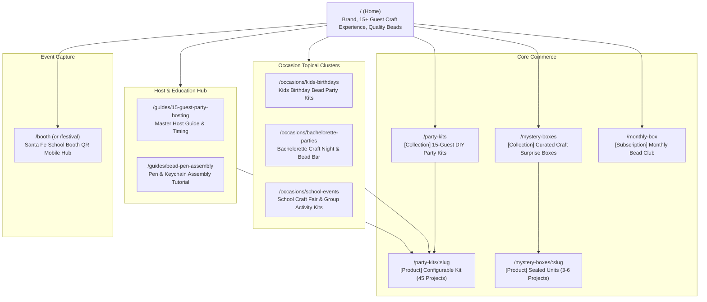

# Technical SEO, Product Schemas & Canonical Redirects Specification

**Document:** `docs/seo/TECHNICAL-SEO-SPEC.md`  
**Date:** October 6, 2026  
**Status:** PROPOSED (Architecture & Implementation Specification)  
**Lead:** Jan (`jan-muwig5mo`), Organic Search & Growth Strategist  
**Collaborators:** Erin (`erin-muwidjtc`, Storefront UX), Jim (`jim-muwibr7y`, Cloudflare Solutions Architect)  
**Reviewers:** Toby (`toby-muwie8nd`, Independent QA), Michael (`god`, Floor Orchestrator)  
**Mission Reference:** [`MISSION-BEADSILY-COMMERCE.md`](file:///C:/repositories/beadsily-com-floor/missions/MISSION-BEADSILY-COMMERCE.md) (§9)  
**Task ID:** `BCF-15` (Phase 2 Foundation & Staged Interface Contract)

---

## 1. Executive Summary & Core Invariant

The BeadsILY commerce platform is built on Cloudflare Workers and Next.js / SSR. In direct-to-consumer e-commerce, **SEO is a structural data and template requirement from the initial build, not a post-launch cosmetic layer**.

### Core Invariants:
1. **Single Canonical Authority:** `https://beadsily.com` is the sole canonical production origin. All secondary domains (`beadsilly.com`), `www` subdomains, and HTTP protocols must permanently 301 redirect at the Cloudflare edge before reaching application rendering.
2. **Deterministic, Clean URLs:** All indexable routes are strictly lowercase, without trailing slashes (except the root `/`), and devoid of session, personalization, or tracking parameters.
3. **Truthful Structured Data:** Schema.org `Product` and `Offer` markups must accurately reflect the base 15-guest kit requirements, exact integer prices in USD, truthful real-time inventory states (`InStock` vs `OutOfStock`), and explicit shipping/return policies.
4. **No Thin Doorway Pages:** Occasion and theme landing pages must provide substantive guidance, verified project counts, and direct links to purchasable BOM configurations, never duplicated keyword-stuffed stubs.

---

## 2. Canonical Domain, URL Structure & Edge Redirect Policy

### 2.1 Domain Cutover Matrix (Cloudflare Edge Middleware)

All edge requests are inspected in the Cloudflare Worker entry point / Next.js middleware prior to cache or page evaluation:

| Incoming Request Pattern | HTTP Status | Target Destination | Rationale |
| :--- | :---: | :--- | :--- |
| `http://beadsily.com/*` | `301 Moved Permanently` | `https://beadsily.com/$1` | Enforce HTTPS security |
| `https://www.beadsily.com/*` | `301 Moved Permanently` | `https://beadsily.com/$1` | Apex canonicalization |
| `http://www.beadsily.com/*` | `301 Moved Permanently` | `https://beadsily.com/$1` | Combined HTTPS + apex |
| `http://beadsilly.com/*` | `301 Moved Permanently` | `https://beadsily.com/$1` | Typo brand domain capture |
| `https://beadsilly.com/*` | `301 Moved Permanently` | `https://beadsily.com/$1` | Typo brand domain capture |
| `https://www.beadsilly.com/*` | `301 Moved Permanently` | `https://beadsily.com/$1` | Typo brand domain capture |
| `https://beadsily.com/PATH/` | `301 Moved Permanently` | `https://beadsily.com/path` | Lowercase + strip trailing slash |
| `https://beadsily.com/path/?utm_*` | Canonical Tag: `https://beadsily.com/path` | Self-referencing clean canonical | Strips tracking from search index |

### 2.2 Edge Middleware Implementation (TypeScript Contract)

```typescript
// packages/domain/src/seo/canonicalMiddleware.ts
export interface RedirectRule {
  shouldRedirect: boolean;
  destination?: string;
  statusCode: 301 | 308;
}

export function evaluateCanonicalUrl(
  requestUrl: URL,
  canonicalHost: string = "beadsily.com"
): RedirectRule {
  const protocol = requestUrl.protocol;
  const host = requestUrl.hostname.toLowerCase();
  const rawPath = requestUrl.pathname;

  let needsRedirect = false;
  let targetHost = host;
  let targetPath = rawPath;

  // 1. Force HTTPS
  if (protocol !== "https:") {
    needsRedirect = true;
  }

  // 2. Canonicalize hostname (redirect www and beadsilly.com)
  if (host === "www.beadsily.com" || host === "beadsilly.com" || host === "www.beadsilly.com") {
    targetHost = canonicalHost;
    needsRedirect = true;
  }

  // 3. Lowercase path normalization
  if (rawPath !== rawPath.toLowerCase()) {
    targetPath = rawPath.toLowerCase();
    needsRedirect = true;
  }

  // 4. Strip trailing slash (unless root "/")
  if (targetPath.length > 1 && targetPath.endsWith("/")) {
    targetPath = targetPath.slice(0, -1);
    needsRedirect = true;
  }

  if (needsRedirect) {
    const targetUrl = new URL(requestUrl.toString());
    targetUrl.protocol = "https:";
    targetUrl.hostname = targetHost;
    targetUrl.pathname = targetPath;
    // Retain original search parameters for user tracking/analytics
    return {
      shouldRedirect: true,
      destination: targetUrl.toString(),
      statusCode: 301,
    };
  }

  return { shouldRedirect: false, statusCode: 301 };
}
```

---

## 3. Information Architecture & Keyword-to-Page Map

BeadsILY addresses high-intent adult purchasers (moms, party planners, bachelorette hosts, school event coordinators). The IA groups content into clear topical clusters:



### 3.1 Keyword Target & Intent Matrix

| URL Path | Primary Target Keyword | Secondary Keywords | Search Intent | Target Action |
| :--- | :--- | :--- | :--- | :--- |
| `/` | `bead party kits` | `diy bead craft party, beaded pen kits, custom bracelet party` | Commercial / Brand | Explore kits & understand 15-guest value |
| `/party-kits` | `party bead kits for 15 guests` | `diy bead bar kit, group bead craft kits, party craft supplies` | Commercial / Transactional | Filter & select party theme kit |
| `/party-kits/:slug` | `[Theme] bead party kit` (e.g. `pastel dream bead party kit`) | `15 guest [theme] craft box, bead pen & bracelet party set` | Transactional | Configure palette, add-on guests & add to cart |
| `/mystery-boxes` | `curated bead mystery box` | `craft mystery box, bead surprise pack, sealed craft box` | Commercial / Transactional | Browse guaranteed-project surprise boxes |
| `/mystery-boxes/mystery-maker` | `mystery bead craft box` | `diy bead mystery kit, 3 project bead surprise box` | Transactional | Purchase one-time mystery maker box |
| `/monthly-box` | `monthly bead subscription box` | `bead craft subscription, monthly jewelry making box` | Commercial / Subscription | Subscribe to monthly curated drop |
| `/occasions/kids-birthdays` | `bead birthday party craft kit` | `kids jewelry making party, birthday activity kit for 15 kids` | Informational / Commercial | Read host guide & click recommended kit |
| `/occasions/bachelorette-parties`| `bachelorette bead bar kit` | `chic craft night for bachelorettes, custom friendship bracelet kit`| Informational / Commercial | Order custom bachelorette party kit |
| `/occasions/school-events` | `school festival craft booth ideas`| `elementary school bead activity, carnival craft station kit` | Informational / Commercial | Review bulk group packages & request info |
| `/guides/15-guest-party-hosting`| `how to host a bead crafting party`| `diy bead party timeline, bead bar setup guide for 15 guests` | Informational | Follow checklist; buy tools & replacement packs |
| `/booth` | `beadsily santa fe festival` | `beadsily fall festival booth, school craft discount code` | Transactional / Local | Scan booth QR, join waitlist, claim event bonus |

---

## 4. Schema.org JSON-LD Structured Data Implementation

All schemas must strictly comply with current Schema.org and Google Search Central specifications.

### 4.1 Product & Offer Schema (15-Guest Base Party Kit)

```json
{
  "@context": "https://schema.org",
  "@type": "Product",
  "name": "Pastel Dream DIY Bead Party Kit (15 Guests, 45 Finished Projects)",
  "description": "Complete all-in-one party craft kit for 15 guests. Each guest creates 3 boutique projects: 1 beaded pen, 1 stretch bracelet, and 1 backpack keychain charm. Includes 45 theme silicone focal beads, 270 spacer beads, hardware, cord, host master guide, tools, and 15 gift bags.",
  "sku": "KIT-PASTEL-15",
  "mpn": "BCF-KIT-01",
  "brand": {
    "@type": "Brand",
    "name": "BeadsILY"
  },
  "image": [
    "https://beadsily.com/images/products/pastel-dream-box-hero.webp",
    "https://beadsily.com/images/products/pastel-dream-supplies-flatlay.webp",
    "https://beadsily.com/images/products/pastel-dream-finished-projects.webp"
  ],
  "offers": {
    "@type": "Offer",
    "url": "https://beadsily.com/party-kits/pastel-dream-party-kit",
    "priceCurrency": "USD",
    "price": "149.00",
    "priceValidUntil": "2027-12-31",
    "itemCondition": "https://schema.org/NewCondition",
    "availability": "https://schema.org/InStock",
    "seller": {
      "@type": "Organization",
      "name": "BeadsILY"
    },
    "eligibleQuantity": {
      "@type": "QuantitativeValue",
      "minValue": 15,
      "unitText": "guest"
    },
    "shippingDetails": {
      "@type": "OfferShippingDetails",
      "shippingRate": {
        "@type": "MonetaryAmount",
        "value": "0.00",
        "currency": "USD"
      },
      "shippingDestination": {
        "@type": "DefinedRegion",
        "addressCountry": "US"
      },
      "deliveryTime": {
        "@type": "ShippingDeliveryTime",
        "handlingTime": {
          "@type": "QuantitativeValue",
          "minValue": 1,
          "maxValue": 2,
          "unitCode": "DAY"
        },
        "transitTime": {
          "@type": "QuantitativeValue",
          "minValue": 3,
          "maxValue": 5,
          "unitCode": "DAY"
        }
      }
    },
    "hasMerchantReturnPolicy": {
      "@type": "MerchantReturnPolicy",
      "applicableCountry": "US",
      "returnPolicyCategory": "https://schema.org/MerchantReturnFiniteReturnWindow",
      "merchantReturnDays": 30,
      "returnMethod": "https://schema.org/ReturnByMail",
      "returnFees": "https://schema.org/FreeReturn"
    }
  }
}
```

### 4.2 Product Schema: Curated Mystery Box (Mystery Maker)

```json
{
  "@context": "https://schema.org",
  "@type": "Product",
  "name": "Mystery Maker Curated Bead Craft Box",
  "description": "Prepacked sealed craft surprise box with guaranteed supplies for 3 complete projects: 1 beaded pen, 1 stretch bracelet, and 1 backpack charm keychain. High quality silicone focals, metal hardware, and coordinated surprise palette.",
  "sku": "MYS-MAKER-01",
  "brand": {
    "@type": "Brand",
    "name": "BeadsILY"
  },
  "image": "https://beadsily.com/images/products/mystery-maker-box.webp",
  "offers": {
    "@type": "Offer",
    "url": "https://beadsily.com/mystery-boxes/mystery-maker",
    "priceCurrency": "USD",
    "price": "24.00",
    "priceValidUntil": "2027-12-31",
    "itemCondition": "https://schema.org/NewCondition",
    "availability": "https://schema.org/InStock",
    "seller": {
      "@type": "Organization",
      "name": "BeadsILY"
    }
  }
}
```

### 4.3 BreadcrumbList Schema

```json
{
  "@context": "https://schema.org",
  "@type": "BreadcrumbList",
  "itemListElement": [
    {
      "@type": "ListItem",
      "position": 1,
      "name": "Home",
      "item": "https://beadsily.com"
    },
    {
      "@type": "ListItem",
      "position": 2,
      "name": "Party Kits",
      "item": "https://beadsily.com/party-kits"
    },
    {
      "@type": "ListItem",
      "position": 3,
      "name": "Pastel Dream Party Kit",
      "item": "https://beadsily.com/party-kits/pastel-dream-party-kit"
    }
  ]
}
```

### 4.4 Organization & WebSite Schema (Homepage)

```json
{
  "@context": "https://schema.org",
  "@graph": [
    {
      "@type": "Organization",
      "@id": "https://beadsily.com/#organization",
      "name": "BeadsILY",
      "url": "https://beadsily.com",
      "logo": {
        "@type": "ImageObject",
        "url": "https://beadsily.com/images/brand/beadsily-logo.svg",
        "caption": "BeadsILY Logo"
      },
      "founder": {
        "@type": "Person",
        "name": "Lua"
      },
      "sameAs": [
        "https://www.instagram.com/beadsily",
        "https://www.facebook.com/beadsily"
      ]
    },
    {
      "@type": "WebSite",
      "@id": "https://beadsily.com/#website",
      "url": "https://beadsily.com",
      "name": "BeadsILY",
      "publisher": {
        "@id": "https://beadsily.com/#organization"
      }
    }
  ]
}
```

---

## 5. URL Parameter & Indexation Governance

To prevent crawl budget waste, index bloat, and duplicate content penalties, strict parameter handling is mandated:

### 5.1 Parameter Policy Table

| Parameter Pattern | Function | Search Index Treatment | Canonical Action |
| :--- | :--- | :--- | :--- |
| `?guests=20` | Dynamic guest count slider | Block / Disregard | Canonical points to clean `/party-kits/:slug` |
| `?palette=sunset` | Optional colorway view | Block / Disregard | Canonical points to base kit URL |
| `?letters=EMMA` | Name personalization preview | No URL state (transient React state) | Never exposed in URL |
| `?page=2` | Collection pagination | Crawlable (`index, follow`) | Self-referencing canonical with `rel="prev"` / `rel="next"` |
| `?sort=price_asc` | Catalog sorting | Disallow in `robots.txt` | Canonical points to unsorted collection URL |
| `utm_*`, `gclid`, `fbclid` | Ad / campaign attribution | Ignore in canonical tag | Canonical points to clean base URL |
| `/search?q=...` | Internal site search | Disallow in `robots.txt` + `noindex` header | Never indexed |
| `/cart`, `/checkout/*` | Shopping bag & payments | Disallow in `robots.txt` + `noindex, nofollow` | Never indexed |
| `/account/*`, `/admin/*` | Authenticated portals | Disallow in `robots.txt` + `noindex, nofollow` | Authenticated edge wall (Turnstile + Cookie) |

### 5.2 Dynamic `robots.txt` Specification

```typescript
// apps/storefront/src/app/robots.ts
import { MetadataRoute } from "next";

export default function robots(): MetadataRoute.Robots {
  return {
    rules: [
      {
        userAgent: "*",
        allow: "/",
        disallow: [
          "/admin/",
          "/account/",
          "/cart",
          "/checkout/",
          "/api/",
          "/search",
          "*?*sort=",
          "*?*filter=",
          "*?*guests=",
        ],
      },
    ],
    sitemap: "https://beadsily.com/sitemap.xml",
    host: "https://beadsily.com",
  };
}
```

### 5.3 Dynamic `sitemap.xml` Specification

```typescript
// apps/storefront/src/app/sitemap.ts
import { MetadataRoute } from "next";

export default async function sitemap(): Promise<MetadataRoute.Sitemap> {
  const baseUrl = "https://beadsily.com";
  const now = new Date();

  // Static core routes
  const staticRoutes: MetadataRoute.Sitemap = [
    { url: `${baseUrl}`, lastModified: now, changeFrequency: "daily", priority: 1.0 },
    { url: `${baseUrl}/party-kits`, lastModified: now, changeFrequency: "daily", priority: 0.9 },
    { url: `${baseUrl}/mystery-boxes`, lastModified: now, changeFrequency: "daily", priority: 0.8 },
    { url: `${baseUrl}/monthly-box`, lastModified: now, changeFrequency: "weekly", priority: 0.8 },
    { url: `${baseUrl}/occasions/kids-birthdays`, lastModified: now, changeFrequency: "weekly", priority: 0.7 },
    { url: `${baseUrl}/occasions/bachelorette-parties`, lastModified: now, changeFrequency: "weekly", priority: 0.7 },
    { url: `${baseUrl}/occasions/school-events`, lastModified: now, changeFrequency: "weekly", priority: 0.7 },
    { url: `${baseUrl}/guides/15-guest-party-hosting`, lastModified: now, changeFrequency: "monthly", priority: 0.6 },
    { url: `${baseUrl}/booth`, lastModified: now, changeFrequency: "weekly", priority: 0.7 },
    { url: `${baseUrl}/about`, lastModified: now, changeFrequency: "monthly", priority: 0.5 },
    { url: `${baseUrl}/faq`, lastModified: now, changeFrequency: "monthly", priority: 0.5 },
    { url: `${baseUrl}/shipping-returns`, lastModified: now, changeFrequency: "monthly", priority: 0.4 },
  ];

  // Dynamic products fetched from D1 (or mock data during build)
  // const products = await getActiveProducts();
  // ... maps products to `/party-kits/${slug}` and `/mystery-boxes/${slug}` with priority 0.8

  return staticRoutes;
}
```

---

## 6. SSR & Next.js App Router Metadata Helpers

To streamline template authoring for Erin (`erin-muwidjtc`), the domain package provides a unified `createSeoMetadata()` helper conforming to Next.js `Metadata`:

```typescript
// packages/domain/src/seo/metadata.ts
import type { Metadata } from "next";

export interface PageSeoConfig {
  title: string;
  description: string;
  path: string;
  image?: string;
  noIndex?: boolean;
}

export function createSeoMetadata(config: PageSeoConfig): Metadata {
  const canonicalUrl = `https://beadsily.com${config.path === "/" ? "" : config.path.toLowerCase().replace(/\/$/, "")}`;
  const defaultImage = "https://beadsily.com/images/brand/beadsily-og-default.jpg";
  const ogImage = config.image || defaultImage;

  return {
    title: {
      default: `${config.title} | BeadsILY`,
      template: "%s | BeadsILY",
    },
    description: config.description,
    alternates: {
      canonical: canonicalUrl,
    },
    robots: config.noIndex
      ? { index: false, follow: false }
      : {
          index: true,
          follow: true,
          googleBot: {
            index: true,
            follow: true,
            "max-video-preview": -1,
            "max-image-preview": "large",
            "max-snippet": -1,
          },
        },
    openGraph: {
      title: `${config.title} | BeadsILY`,
      description: config.description,
      url: canonicalUrl,
      siteName: "BeadsILY",
      images: [
        {
          url: ogImage,
          width: 1200,
          height: 630,
          alt: config.title,
        },
      ],
      locale: "en_US",
      type: "website",
    },
    twitter: {
      card: "summary_large_image",
      title: `${config.title} | BeadsILY`,
      description: config.description,
      images: [ogImage],
    },
  };
}
```

---

## 7. School Booth QR Code Landing Page Strategy (October 23 Event)

For the Santa Fe Elementary Fall Festival:
- **Dedicated Route:** `/booth` (clean URL, high contrast, mobile optimized for fast cellular loading).
- **Physical QR Code:** Prints on tabletop signage, booth canopy banners, and guest handout cards.
- **Conversion Goals:**
  1. Instant mobile view of party kits for parents attending the festival.
  2. Adult email & phone intake for booking post-festival party kits (with special event discount code `SANTAFE2026`).
  3. Waitlist registration for the upcoming Monthly Bead Subscription Box.
- **Technical SEO Hygiene:** The page is fully indexable with structured `Event` and `Offer` data, establishing local authority for Chandler/Phoenix area school craft activities.

---

## 8. Verification & QA Acceptance Matrix (`ACCEPTANCE-MATRIX.md`)

Toby (`toby-muwie8nd`) and independent CI pipelines will certify technical SEO against these testable assertions:

| Test ID | Area | Assertion / Verification Criteria | Pass Condition |
| :--- | :--- | :--- | :--- |
| `SEO-01` | Canonical Redirects | `GET http://beadsily.com/party-kits` | Returns HTTP `301`, `Location: https://beadsily.com/party-kits` |
| `SEO-02` | Domain Normalization | `GET https://beadsilly.com/occasions` | Returns HTTP `301`, `Location: https://beadsily.com/occasions` |
| `SEO-03` | Slash & Casing | `GET https://beadsily.com/Party-Kits/` | Returns HTTP `301`, `Location: https://beadsily.com/party-kits` |
| `SEO-04` | Canonical Meta Tag | Rendered HTML on `/party-kits/pastel-dream?guests=20&utm_source=fb` | `<link rel="canonical" href="https://beadsily.com/party-kits/pastel-dream" />` |
| `SEO-05` | Product JSON-LD | Rendered JSON-LD script on `/party-kits/pastel-dream` | Valid Schema.org `Product` & `Offer` with USD cents, inStock, 15 guest minimum |
| `SEO-06` | Mystery Box Schema | Rendered JSON-LD script on `/mystery-boxes/mystery-maker` | Valid `Product` schema with guaranteed 3 project count description |
| `SEO-07` | Robots.txt | `GET /robots.txt` | Disallows `/admin/`, `/account/`, `/checkout/`, includes `Sitemap: https://beadsily.com/sitemap.xml` |
| `SEO-08` | Sitemap.xml | `GET /sitemap.xml` | Valid XML response containing all active canonical product & occasion URLs |
| `SEO-09` | Mobile Performance | Mobile Lighthouse audit on `/` and `/party-kits` | LCP <= 2.5s, CLS <= 0.1, INP <= 200ms |

---

## 9. Next Actions & Handoffs

1. **Jim (`jim-muwibr7y`):** Incorporate the edge redirect middleware into the Cloudflare Worker request pipeline.
2. **Erin (`erin-muwidjtc`):** Integrate `createSeoMetadata()` and JSON-LD script components into the Next.js storefront layout and product page templates (`BCF-8`, `BCF-11`).
3. **Toby (`toby-muwie8nd`):** Register `SEO-01` through `SEO-09` test suite assertions into the automated acceptance test harness (`BCF-10`).
4. **Michael (`god`):** Review and incorporate into the floor status report for Korry Nelson.
